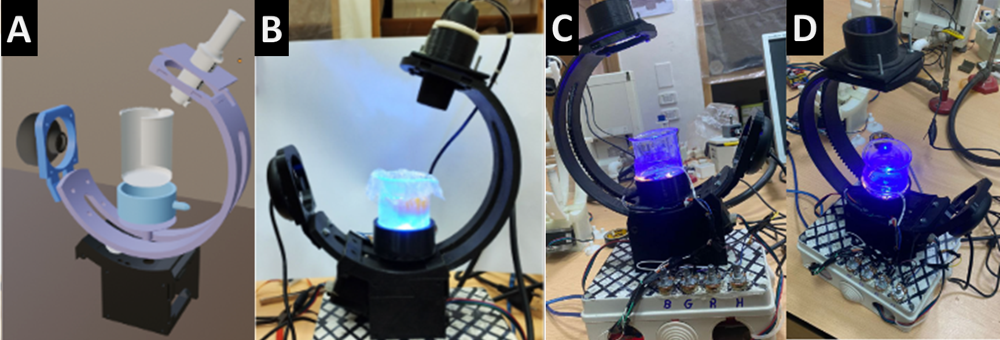

# **
 Katkoot V3.
**
## 
 DIY 3D printing based Shell-less system for birds embryo. 

## 
 RDI Prototyping Lab, Faculty of Biotechnology, MSA university. 

 Authors: Ziyad Adbelal, Doha Ibrahim, Adam Maged, Mostafa Hesham, and  Ahmed Gomaa. 

 

 
 

**Description:**

KatKoot V3 represents a groundbreaking advancement in avian embryo monitoring technology, leveraging a fusion of cutting-edge features. This innovative system seamlessly integrates a sophisticated 3D scanning apparatus with open-source capabilities, facilitating detailed examination of embryo development. Its unique design incorporates both microscopic and wide-angle components, ensuring precise observation at various scales. Moreover, KatKoot V3 introduces a novel temperature control mechanism, crucial for maintaining optimal conditions for embryo growth outside of the shell. This system enables real-time monitoring of avian embryo development, offering researchers and breeders invaluable insights. Complemented by customizable RGB lighting, KatKoot V3 stands at the forefront of avian reproductive research, promising unparalleled accuracy and versatility in embryo monitoring.

# Link to 3D model: https://skfb.ly/oSCyQ
# Link to Video:
# Link to Preprint article: https://doi.org/10.6084/m9.figshare.25471090.v1
